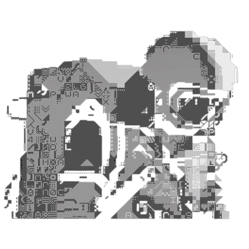

  

<h1 align="center">Olá 👋, sou Henrique Ronchi Teixeira</h1>

<h3 align="center">Engenheiro de Dados</h3>

  

Desenvolvendo estruturas de dados confiáveis, pipelines eficientes e soluções escaláveis.

<h2 align="center">🚀 Sobre Mim </h2>

Olá, me chamo **Henrique**! 

Sou estudante e focado em **Engenharia de Dados**. Tenho interesse no desenvolvimento de pipelines de dados, modelagem e otimização de bancos de dados relacionais e não-relacionais, além de arquiteturas em nuvem.

Atualmente estou aprimorando meus conhecimentos em **Python, SQL, Bancos de Dados e Cloud (AWS)**, além de praticar Estruturas de Dados e Algoritmos.

Meu objetivo é escrever código limpo, construir ambientes de dados sólidos e evoluir como profissional na área de dados.

 

<h2 align="center">🤝 Conecte-se Comigo</h2>

  
  &nbsp;&nbsp;&nbsp;
  
  &nbsp;&nbsp;&nbsp;
  

<h2 align="center">💻 Tech Stack</h2>

  

<h2 align="center">📊 Estatísticas do GitHub</h2>

<h2 align="center">📈 Gráfico de Atividade</h2>

  

<h2 align="center">⌘ Histórico de Commits</h2>

<picture>
  <source media="(prefers-color-scheme: dark)"
    srcset="https://raw.githubusercontent.com/hteixeira-dev/hteixeira-dev/output/pacman-contribution-graph-dark.svg">

  <source media="(prefers-color-scheme: light)"
    srcset="https://raw.githubusercontent.com/hteixeira-dev/hteixeira-dev/output/pacman-contribution-graph.svg">

  
</picture>

<h2 align="center">⌘ Filosofia</h2>

  

